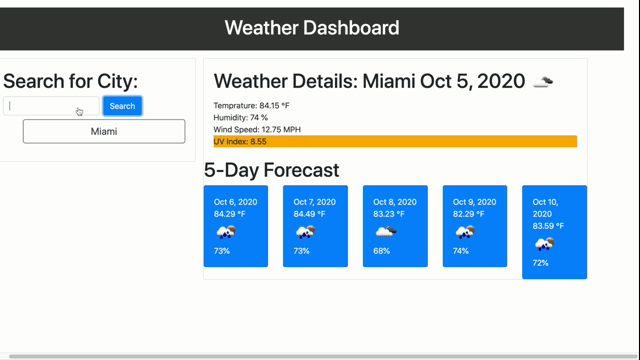

# Weather-Dashboard

*   Linked cdns
*   Made an on click event to search a city which then will display a day forcast and a 5 day forecast
*   Used moment to format the display date
*   Used three seperate queryUrls
*   Made dynamic card to display weather deatils after a search
*   Used CSS to color code UV index hazard levels
*   Created another on click event to see the history details on your city weather search

    GitHub: https://github.com/Moon-Ingenium/Work-Day-Scheduler.git